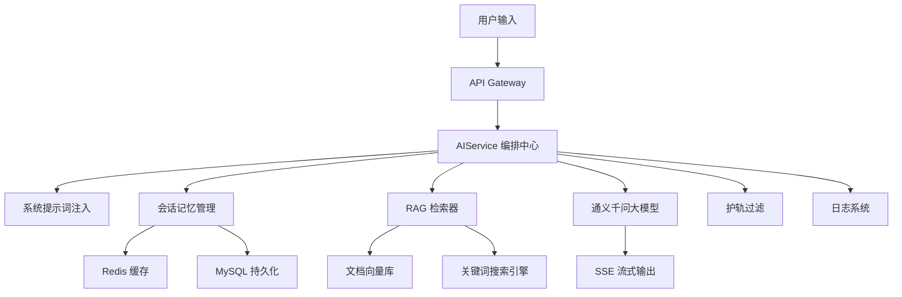

# IntelliQ - AI 问答机器人

IntelliQ 是一个基于 LangChain4j 构建的企业级 AI 问答机器人，集成通义千问大模型，提供多模态输入支持、RAG 检索增强、会话记忆及流式响应等功能，旨在构建可扩展、可观测、智能化的问答系统。

## 核心功能

### 🔍 多模态支持
- 支持文本和 PDF 文档作为知识输入源
- 自动解析 PDF 内容并生成向量索引，用于高效检索
- 通过 LangChain4j 统一编排文本与文档内容，实现一体化问答处理

### 🎯 系统提示词（System Prompt）
- 问答前自动注入系统提示词，引导大模型行为
- 支持动态修改提示词，灵活调整问答策略

### 🧠 AIService 编排中心
- 统一处理所有问答请求，负责上下文管理、模型调用与检索触发
- 支持多策略组合（RAG 检索 + 工具调用 + 系统提示词）

### 💾 会话记忆
- 分用户会话记忆，保证多轮对话上下文连续性
- 采用 Redis 缓存实现快速访问
- 基于 MySQL 持久化存储，确保数据可靠与可追溯

### 📊 格式化输出
- 支持 JSON Schema 校验，保证结构化数据一致性
- 可生成 `prompt JSON` 或 `prompt` 格式，便于前端/下游工具解析

### 🔄 RAG 检索增强
- 自定义检索器，支持文档向量匹配与关键词搜索
- 集成工具调用能力（计算、接口查询等）
- 内置 MCP（Multi-Context Prompting）机制，优化长文本/复杂问题处理

### 🛡️ 护轨操作
- 内置正则过滤机制，防止敏感内容输出
- 支持自定义规则，确保输出符合业务规范与安全要求

### 📝 日志与可观测化
- 详细记录问答全流程：
  - 被选中的文档及片段
  - 文档来源信息
  - 系统提示词与检索内容
- 支持日志流式监控与分析，便于系统调优和审计

### ⚡ SSE 流式输出
- 基于 Server-Sent Events (SSE) 实现流式内容输出
- 实时展示模型生成内容，提升用户交互体验

## 技术架构

（此处可插入架构图，建议使用 mermaid 语法或图片链接）

## 许可证

本项目采用 [Apache 2.0 许可证](LICENSE)
